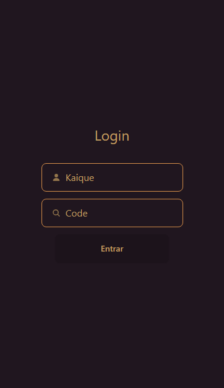

# ChatApp

É um chat que permite que os usuários entrem em salas específicas para conversar entre si.

## 🛠 Tecnologias utilizadas
- React
- Typescript
- Context API
- TailwindCSS
- DaisyUI
- NodeJS
- Express
- Socket.io

## Screenshot
 

